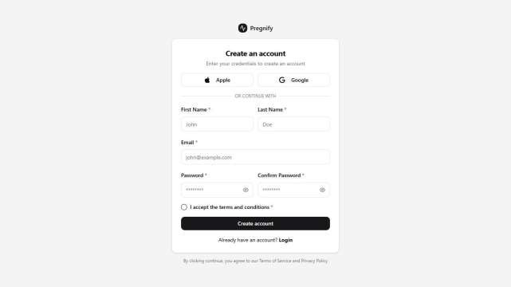
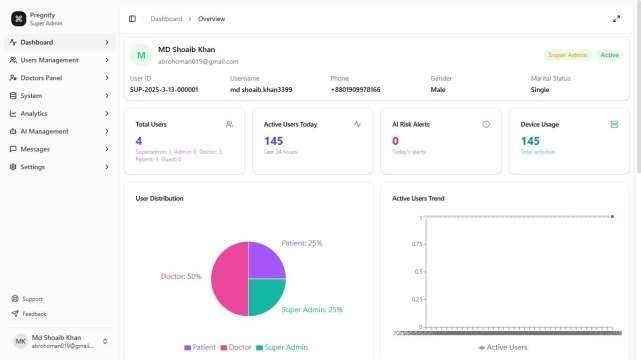
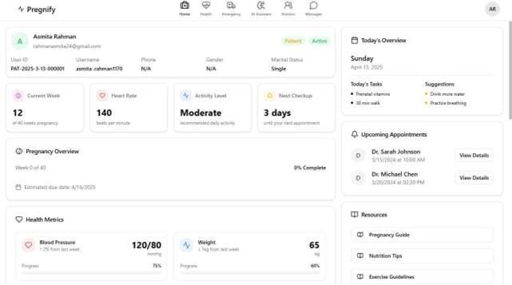

# Pregnify

**Pregnify** is an AI-powered pregnancy health management and risk prediction platform built with modern web technologies. It provides an all-in-one solution for patients, doctors, and administrators to manage healthcare, track health data, and make informed decisions throughout the pregnancy journey.

## 🚀 Features

### Key Features for Users:
- 🤖 **AI-Based Pregnancy Risk Prediction**: Get personalized pregnancy risk scores and recommendations.
- 📈 **Real-time Health Monitoring**: Track vital signs and health indicators in real time.
- 💬 **Doctor-Patient Communication**: Secure messaging, audio, and video calls between patients and doctors.
- 🏥 **Emergency Services**: One-click calls to doctors, hospitals, or ambulances for emergencies.
- 🩺 **Personalized 10-Month Diet and Health Plan**: Custom diet and health plan based on medical, lifestyle, and vital sign data.
- ⚡ **Smart Chat System**: In-chat payment processing, multimedia messages, emoji reactions, and @mentions for better communication.
- 🛡️ **Role-Based Authentication**: Separate user roles such as Guest, Patient, Doctor, Admin, and Super Admin with tailored access and permissions.
- 📊 **Analytics & Reports**: View health data trends, predictions, and risk assessments in visual charts and reports.
- 📱 **Cross-Platform Support**: Available on Web, iOS, Android, and a Smartwatch App for real-time monitoring and notifications.

### Key Features for Admin & Super Admin:
- ⚙️ **Dynamic Admin Dashboard**: Manage users, roles, and patient data with comprehensive control.
- 🔒 **Activity & Session Logs**: Track user activities, login attempts, session history, and IP addresses for security.
- 📈 **Advanced Analytics**: Admins can monitor overall platform usage and user health data trends.
- 💸 **Payment Integration**: Admins can configure and monitor in-app payments for consultations, emergencies, and services.

## 🧱 Tech Stack

### Backend
- **Node.js + Express**: REST API for core backend services
- **Prisma ORM**: For managing MySQL database
- **JWT + Refresh Tokens**: Secure user authentication with token-based sessions
- **OpenAI & DeepSeek LLM**: For AI-powered predictions and recommendations

### Frontend
- **React + Vite**: Modern frontend framework with fast bundling
- **Tailwind CSS**: For rapid styling
- **ShadCN UI**: Provides a sleek and responsive UI design
- **Chart.js**: For creating dynamic and interactive charts

## 🖼️ UI Demo

### Authentication Pages

### Dashboard Overview

### Health Monitoring

## 📝 License
This project is licensed under the MIT License - see the [LICENSE](LICENSE) file for details.

## 📚 Documentation
For development setup and contribution guidelines, please refer to our [DEVELOPMENT.md](DEVELOPMENT.md) document.

## 🤝 Contributing
Contributions are welcome! Please feel free to submit a Pull Request. For major changes, please open an issue first to discuss what you would like to change.

